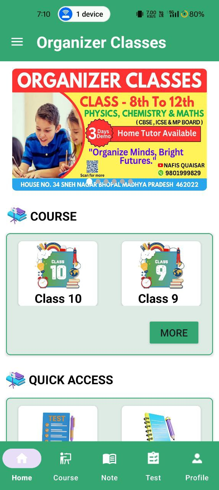
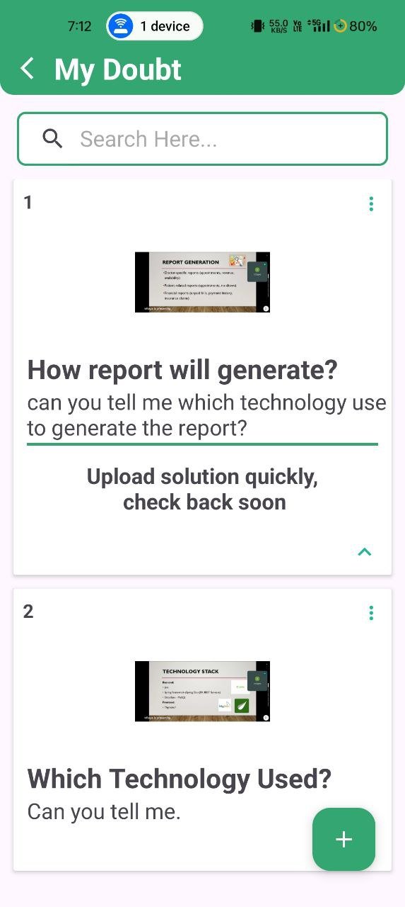
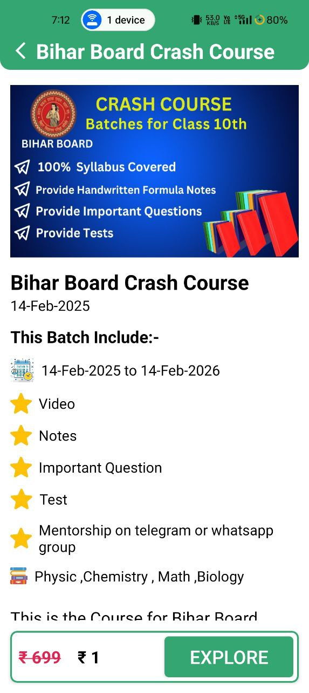
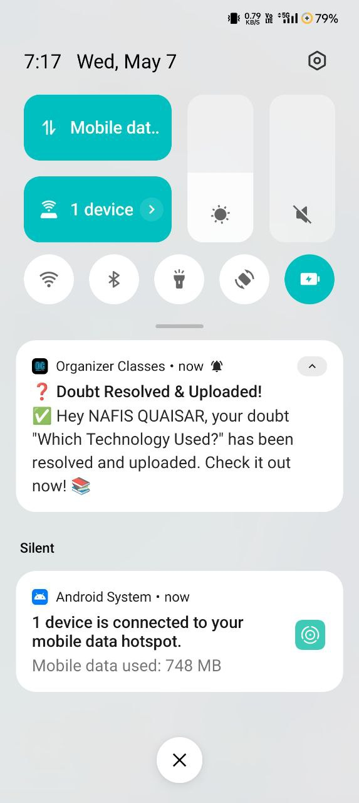
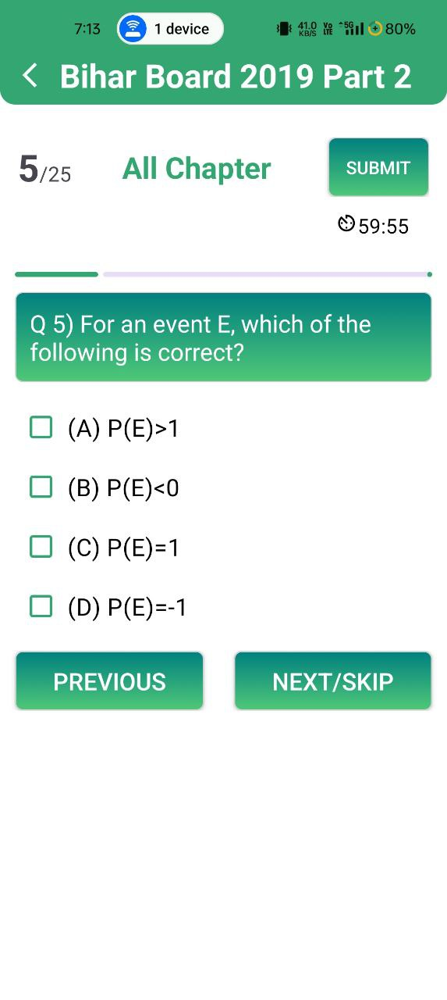
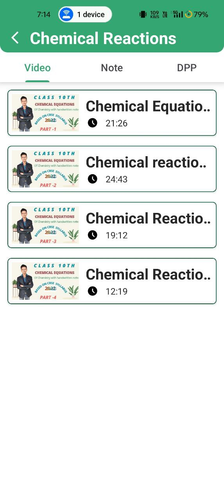
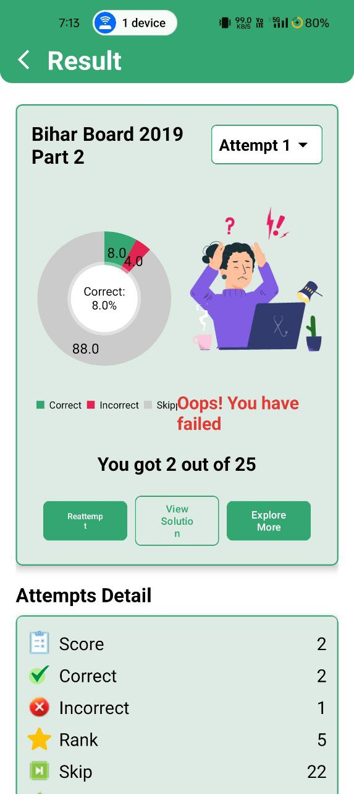

# Organizer Classes

Welcome to the **Organizer Classes App**! This app contains **videos**, **notes**, and **Previous Year Questions (PYQ)** from various boards like **Bihar Board**, **MP Board**, and **CBSE**. It also provides features like a doubt-solving section, exclusive course access, and personalized test options to help students prepare more effectively.

---

## 🚀 Features

### 📚 Educational Content
- Videos covering multiple subjects and topics.
- **PYQs** for major boards:
  - Bihar Board
  - MP Board
  - CBSE
- Handwritten and digital **notes** included.

### ❓ Doubt Section
- A dedicated section for students to ask and resolve doubts directly with educators.

### 🛒 Exclusive Course Purchase
- Access premium content via paid courses.
- Integrated with **Razorpay** for smooth and secure payments.

### 🧪 Individual and Chapter-Wise Tests
- Take **subject-wise** and **chapter-wise** tests.
- Includes **objective PYQ** practice.

### 🔔 Notifications & Email Integration
- Get **real-time notifications** when new content is uploaded.
- Receive an **email confirmation** upon registration.
- Receive **PDF invoices** after course purchases.

---

## 📸 Screenshots

Here are some screenshots showcasing the app features:

|  |  |  |
|----------------------------------------------|-------------------------------------------|-----------------------------------------------------|
| **Home Screen**                               | **Doubt Section**                          | **Course Purchase**                                 |

|  |  |  |
|----------------------------------------|------------------------------------|--------------------------------------------------|
| **Test Section**                       | **PYQ Test**                        | **Notifications**                                |

|  |  |  |
|----------------------------------|------------------------------------|--------------------------------------|
| **Quiz Section**                 | **Video Section**                  | **Result Analysis**                  |

---

## 🎥 Project Video

---

## 📲 Download Now

➡️ [Download from Google Play Store](https://play.google.com/store/apps/details?id=com.nafis.organizerclasses)

---

## 🛠️ Technologies Used
### 👨‍💻 Frontend
- **Android** with **Kotlin** and **XML layouts**

### ☁️ Backend / Cloud Services
- **Firebase Authentication** – Secure login and registration
- **Firebase Realtime Database** – Real-time data sync
- **Firebase Firestore** – Structured data storage for quizzes, users, etc.
- **Firebase Cloud Messaging (FCM)** – Push notifications

### 📊 Data Visualization
- [`MPAndroidChart`](https://github.com/PhilJay/MPAndroidChart) – For rendering pie charts, bar graphs, etc.

### 🔐 Authentication & API
- `google-auth-library-oauth2-http` – Google OAuth integration
- `okhttp` – Making HTTP requests
- `gson` – JSON parsing and serialization

### 📧 Communication
- `javax.mail` (Sun Mail) – For sending emails (registration confirmation, receipts, etc.)

### 📄 PDF Handling
- `iText 7` – For generating dynamic PDF bills/invoices
---

## 📩 Contact

For queries, support, or feedback:  
📧 **Email**: [nafisnafis391@gmail.com]  
📞 **Phone**: +91-9801999829
